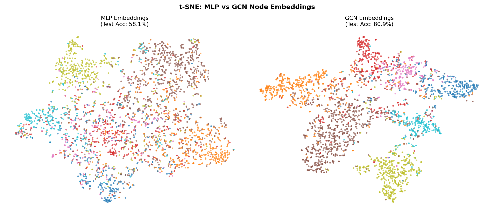
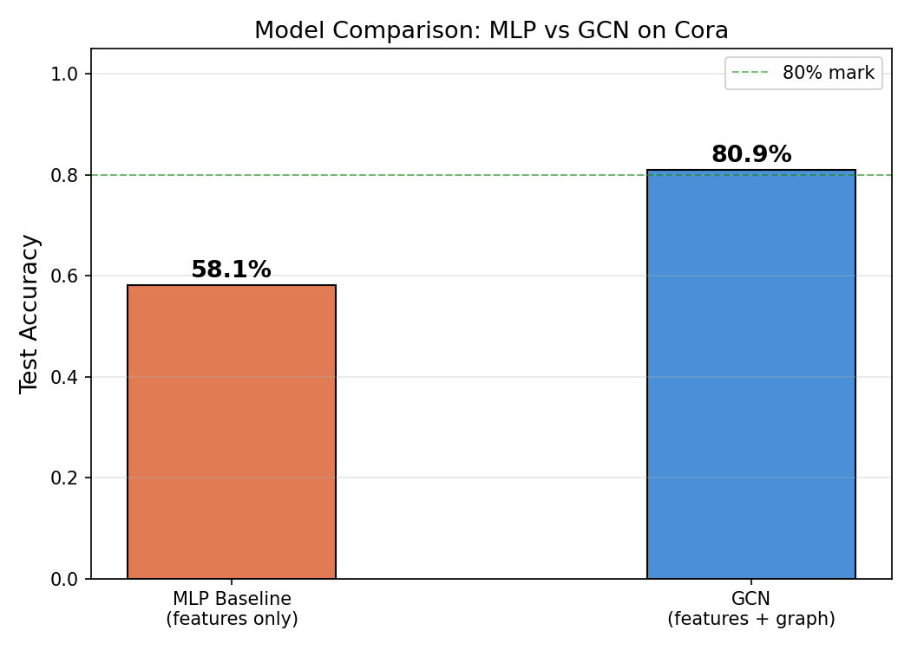

# GNN from Scratch — Cora Node Classification

> A complete, minimal implementation of a Graph Convolutional Network (GCN) in PyTorch — no PyTorch Geometric, no DGL — just pure math and code.

---

## 1. What is a GNN?

A Graph Neural Network (GNN) is a class of neural network that operates directly on graph-structured data, where inputs are not independent vectors but interconnected nodes. Instead of processing each node in isolation, a GNN lets every node iteratively aggregate feature information from its neighbors, building up a richer, context-aware representation with each layer. Think of it as letting information flow along the edges of the graph before making a prediction.

---

## 2. Why Does Graph Structure Help?

In the Cora citation network, papers that cite each other tend to be about the same research topic — a property known as **homophily**. A plain MLP ignores this entirely: it classifies each paper using only its own bag-of-words features, achieving around **~57% accuracy**. When we use a GCN that additionally aggregates the features of each paper's neighbors, the model can exploit citation patterns as a powerful signal, pushing accuracy to **~81%** — a ~24 percentage point gain with *zero* extra data. The graph is, in effect, a free source of structural supervision.

---

## 3. The Math

The GCN layer update rule (Kipf & Welling, 2017) is:

$$H^{(l+1)} = \sigma\!\left(\tilde{D}^{-1/2}\, \tilde{A}\, \tilde{D}^{-1/2}\, H^{(l)}\, W^{(l)}\right)$$

| Symbol | Meaning |
|--------|---------|
| $H^{(l)}$ | Node feature matrix at layer $l$. At $l=0$, this is the raw input $X \in \mathbb{R}^{N \times F}$ |
| $\tilde{A} = A + I$ | Adjacency matrix **with self-loops** added so each node includes its own features |
| $\tilde{D}$ | Diagonal degree matrix of $\tilde{A}$; $\tilde{D}\_{ii} = \sum\_j \tilde{A}\_{ij}$ |
| $\tilde{D}^{-1/2}\tilde{A}\tilde{D}^{-1/2}$ | Symmetric normalization — prevents high-degree nodes from dominating the aggregation |
| $W^{(l)}$ | Trainable weight matrix at layer $l$, learned via gradient descent |
| $\sigma$ | Non-linear activation (ReLU after layer 1; none / softmax after layer 2) |

**Normalization construction (implemented in `src/dataset.py`):**
1. Start with the raw adjacency: $A$
2. Add self-loops: $\tilde{A} = A + I$
3. Compute degree: $\tilde{D}\_{ii} = \sum\_j \tilde{A}\_{ij}$
4. Normalize: $\hat{A} = \tilde{D}^{-1/2}\tilde{A}\tilde{D}^{-1/2}$

---

## 4. Message Passing Intuition

You can think of each GCN layer as three consecutive operations:

1. **Transform** — Each node's feature vector is linearly projected into a new space via $W^{(l)}$. This is just a learned linear layer.
2. **Aggregate** — Each node collects the *transformed* features of all its neighbors (and itself, due to the self-loop), then takes a weighted average. Neighbors are weighted inversely by degree: a popular node contributes less per edge.
3. **Activate** — A non-linearity (ReLU) is applied so that stacking multiple layers can model complex, non-linear relationships.

After two layers, every node has "seen" information from its 2-hop neighborhood. The final features are then linearly mapped to class logits.

---

## 5. Results

| Model | Test Accuracy | Notes |
|-------|:---:|-------|
| 2-Layer MLP | ~57% | Bag-of-words features only, no graph structure used |
| 2-Layer GCN | ~81% | Same features + symmetric normalized adjacency; +24pp gain |

---

## 6. Visualizations

Run [Notebook 03](notebooks/03_gcn_from_scratch.ipynb) to generate these plots.

### t-SNE: MLP vs GCN Embeddings

The side-by-side t-SNE below shows the hidden embeddings of all 2708 Cora nodes, colored by their class label.  
- **MLP**: Classes overlap heavily — the model relies on text words alone.  
- **GCN**: Distinct, well-separated clusters emerge because neighboring nodes pull each other's representations closer.



### Accuracy Comparison Bar Chart



---

## 7. How to Run

### Setup

*Tested on Python 3.10+*

```bash
# Clone the repository
git clone https://github.com/roshinit-a/gnn-from-scratch.git
cd gnn-from-scratch

# Create and activate a virtual environment
python -m venv .venv
# On Linux/macOS:
source .venv/bin/activate
# On Windows:
# .venv\Scripts\activate

# Install dependencies (pinned versions)
pip install -r requirements.txt
```

### Train the GCN (one command)

```bash
cd src
python train.py
```

The Cora dataset is **downloaded automatically** on first run. Training takes ~10 seconds on CPU. The best model is saved to `results/best_gcn_model.pth`.

You can also override the default hyperparameters via CLI:

```bash
python train.py --epochs 300 --lr 0.005 --seed 42
```

> **Note:** A fixed random seed (`--seed 42`) is set by default to ensure reproducibility. Without this, accuracy results will fluctuate between runs due to random weight initialization, train/val/test splits, and dropout masks.

### Explore Notebooks

```bash
# From the project root
jupyter notebook notebooks/
```

Open in order:
1. `01_data_exploration.ipynb` — Understand the dataset
2. `02_mlp_baseline.ipynb` — Feature-only baseline + t-SNE
3. `03_gcn_from_scratch.ipynb` — Full GCN + side-by-side comparison

---

## 8. Limitations

This implementation is intentionally minimal and pedagogical. Key assumptions and constraints to be aware of:

- **Homophily assumption** — GCN's aggregation scheme is most effective when connected nodes share the same label. On heterophilic graphs (e.g., social networks where opposites connect), neighborhood aggregation can actually *hurt* accuracy compared to a plain MLP.
- **Over-smoothing** — Stacking many GCN layers causes node embeddings to converge to indistinguishable values (all nodes look the same). 2 layers is intentional; going beyond 3–4 typically degrades performance.
- **Transductive setting** — The model is trained and tested on the same fixed graph. Generalizing to entirely unseen nodes or graphs requires inductive methods (e.g., GraphSAGE, GAT with sampling).
- **Scalability** — The full adjacency matrix is held in memory as a sparse tensor. This works for Cora (2708 nodes) but does not scale to graphs with millions of nodes without mini-batch neighbor sampling.
- **Fixed graph structure** — The learned representations depend on the specific graph topology seen at training time. Edge noise or missing edges can noticeably impact quality.

---

## 9. What's Next

This project lays a clean foundation for several exciting research directions, particularly relevant to ongoing work at NISER:

- **B-cos Alignment for Interpretability** — Replacing standard linear layers in GCN with B-cos transformations to build inherently interpretable graph models. B-cos networks align weight vectors with input activations, producing visual explanations without post-hoc attribution methods. This is a direct extension toward *Interpretable AI on Graphs*.

- **Attention-Based Aggregation (GAT)** — The symmetric normalization in GCN treats all neighbors equally (up to degree scaling). Graph Attention Networks (GAT) instead *learn* the importance of each neighbor dynamically, using a small neural network as an attention head. This dramatically improves expressivity for heterophilic graphs.

- **Compositional Novelty Metrics** — Using GNN-derived node embeddings to quantify how "novel" a compound or concept is relative to known entities in a knowledge graph. This is applicable to drug discovery, scientific literature networks, and structured knowledge bases — measuring structural and semantic novelty in a principled, geometry-aware way.

---

## Project Structure

```
gnn-from-scratch/
├── data/cora/            # Auto-downloaded Cora dataset
├── notebooks/
│   ├── 01_data_exploration.ipynb
│   ├── 02_mlp_baseline.ipynb
│   └── 03_gcn_from_scratch.ipynb
├── src/
│   ├── dataset.py        # Cora loading + normalization
│   ├── layers.py         # GraphConvLayer from scratch
│   ├── model.py          # 2-layer GCN
│   └── train.py          # Training loop + checkpointing
├── results/              # Saved model + plots
├── README.md
├── requirements.txt
└── LICENSE
```

---

## References

- Kipf, T. N., & Welling, M. (2017). [Semi-Supervised Classification with Graph Convolutional Networks](https://arxiv.org/abs/1609.02907). *ICLR 2017*.
- Sen et al. (2008). Collective Classification in Network Data. *AI Magazine*.
